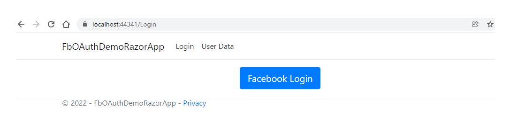
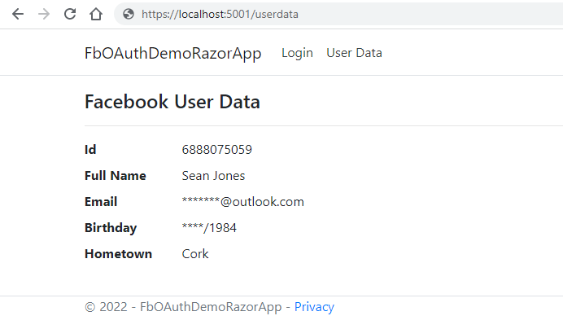

# FbOAuthNetCore 

FbOAuthNetCore is a .NET 5 based web application that demonstrates the OAuth2 token flow to allow users to login to the application with their facebook credentials. Here is an overview of how the application works: 
- When the application is launched, the user can click on the Login button and this will initiate the facebook authentication. This redirects the user to the login URL specific to a previously configured facebook app. 

- The user is prompted to enter their username and password if not already logged in
- The user is requested to confirm the information that will be shared with the app
- Once the success response has been received by the callback endpoint, a token is requested and checked for validity. 
- The application attaches a JWT cookie which embeds the facebook oauth2 token so that the logged in user can be identified. This could be further enhanced to store more user information besides the token and also use the user ID or email address to identify a user entry in the db
- THe JWT cookie is detected for each subsequent Http request to the app using the JwtMiddleware. THe user context (i.e. just the token for now) is extracted and is used in the controllers to request data from the facebook API.
- After login is successful, the user is directed to a user data view (which retrieves the current user data from the API - name, birthday, hometown)

